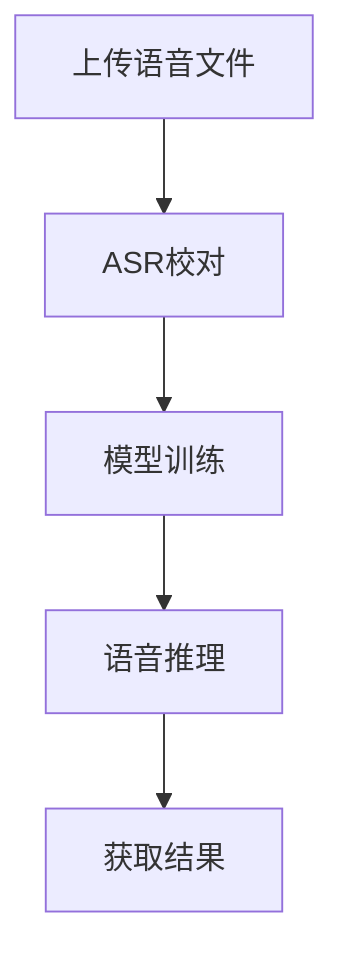

# MockVox API 简明指南

## 概述

本API提供语音处理、模型训练与推理的全流程服务，核心功能包含：

- 🎵 语音文件预处理（切片/降噪） 
- 🎓 GPT-SoVITS模型训练
- 🎙️ 多语言语音推理合成
- 📊 异步任务状态追踪

[👉 获取完整API手册](http://127.0.0.1:5000/docs)

## 快速开始

```bash
# 上传语音文件
 curl -X POST -F "file=@sample.wav" \
    -F "language=en" \
    http://127.0.0.1:5000/upload

# 启动训练任务
curl -X POST \
    -F "file_id=20250522095117519601.e6abd9db.896806622ccb47a9ac1ee1669daf1938" \
    -F "language=en" \
    http://127.0.0.1:5000/train

# 上传参考语音

curl -X POST -F "ref_audio=@reference.mp3" -F "target_text=你好世界" http://127.0.0.1:5000/inference
```

## 使用流程



### 1. 语音文件预处理

**接口路径**：`POST /upload`

关键参数：
| 参数 | 类型 | 说明 |
|------|------|-----|
| file | File | 支持 WAV/MP3/FLAC 格式 |
| version | String | 处理引擎版本(默认v4，支持v2/v4)|
| language | String | 语言(默认zh, 支持zh/can/en/ja/ko)

响应示例：

```json
{
    "file_id": "20250522095117519601.e6abd9db.896806622ccb47a9ac1ee1669daf1938",
    "task_id": "40425f97-11ab-4d68-b645-bd8dda294c4c"
}
```

### 2. ASR结果校对

**接口路径**：`POST /revision`

请求格式：

```json
{
    "file_id": "20250522095117519601.e6abd9db.896806622ccb47a9ac1ee1669daf1938",
    "results": [
        {"key": "0000000000_0000193600", "text": "Hello world"},
        {"key": "0000193600_0000361920", "text": "Good morning"}
    ]
}
```

### 3. 模型训练

**接口路径**：`POST /train`

训练参数配置：

```python
{
    "epochs_sovits": 3,  # SoVITs训练轮次
    "epochs_gpt": 3,      # GPT训练轮次
    "language": "en",      # 支持多语言
    "config": {}           # 高级参数配置
}
```

### 4. 语音推理

**接口路径**：`POST /inference`

多语言支持：

```python
{
    "target_language": "jp",  # 可选 zh/en/jp/yue/kr
    "speed": 1.2              # 语速调节(0.5-2.0)
}
```

## 任务监控

```python
GET /tasks/{task_id}

响应示例
{
    "status": "SUCCESS",
    "results": "output.wav",
    "time": "2024-03-15T14:30:00"
}
```

## 注意事项

1. **文件规范**：
   - 最大上传尺寸：`5000MB`
   - 支持格式：`.wav` > `.flac` > `.mp3`

2. **错误处理**：

```json
{
    "detail": "文件大小超过限制（错误码413）"
}
```

3. **性能建议**：
   - 训练任务建议配置 ≥16GB显存
   - 推理任务延迟约 3-8秒（取决于文本长度）

[🔧 查看实时API文档](http://127.0.0.1:5000/docs)  
[🐳 获取Docker部署指南](https://github.com/mockvox/README.md)
```
