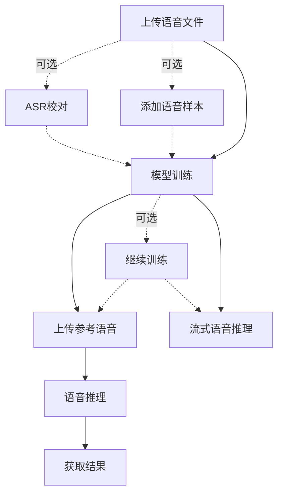

# MockVox API 简明指南

## 概述

本API提供语音处理、模型训练与推理的全流程服务，核心功能包含：

- 🎵 语音文件预处理（切片/降噪） 
- 🎓 GPT-SoVITS模型训练
- 🎙️ 多语言语音推理合成
- 📊 异步任务状态追踪

## 快速开始

```bash
# 上传语音文件
 curl -X POST -F "file=@sample.wav" \
    -F "language=zh" \
    http://127.0.0.1:5000/upload
# 返回 file_id

# 启动训练任务
curl -X POST \
    -F "file_id={file_id}" \
    -F "epochs_sovits=2" \
    -F "epochs_gpt=2" \
    http://127.0.0.1:5000/train
# 返回 model_id

# 上传参考语音
curl -X POST -F "file=@ref.wav" http://127.0.0.1:5000/uploadRef
# 返回 ref_file_id

# 推理
curl -X POST -F "model_id={model_id}" \
-F "ref_audio_file_id={ref_file_id}" \
-F "ref_text=生日快乐" \
-F "target_text=让我们庆祝吧" \
http://127.0.0.1:5000/inference

# 获取推理结果
curl -X GET http://127.0.0.1:5000/output/{task_id}
```

## 使用流程



### 1. 语音文件预处理

**接口路径**：`POST /upload`

参数：

| 参数 | 类型 | 说明 | 默认值 | 必填 |
|------|------|-----|-----|-----|
| file | File | 支持 WAV/MP3/FLAC 格式 | - | 是 |
| language | String | 语言(支持zh/can/en/ja/ko) | zh | 否 |

响应示例：

```json
{
    "file_id": "20250522095117519601.e6abd9db.896806622ccb47a9ac1ee1669daf1938",
    "task_id": "40425f97-11ab-4d68-b645-bd8dda294c4c"
}
```

### 2. 添加语音样本到现有数据

**接口路径**：`POST /add`

**功能**：向已有上传样本追加新的音频文件

| 参数                | 类型 |  说明                                  | 默认值 | 必填 |
|--------------------|------|---------------------------------------|--------|------|
| `file`      | File | 新音频文件                      | -   | 是   |
| `file_id`   | String |  /upload 接口返回的文件ID                      | -      | 是   |

1. 将新音频添加到指定 fileID 的数据集中
2. 自动执行与原上传相同的预处理流程
3. ASR 识别结果会​​增量更新​​到原目录：./data/asr/{fileID}/output.json
4. 语音切片和降噪结果将存放在原始文件ID对应的目录中
5. 所有数据统一使用原始 fileID 进行关联

### 3. ASR结果校对

**接口路径**：`POST /revision`

**说明**: ASR 结果可通过 `GET /tasks/{task_id}` 获取

```json
    "asr": [
        {"key": "0000000000_0000193600", "text": "Hello world"},
        {"key": "0000193600_0000361920", "text": "Good morning"}
    ]
```

参数：

| 参数 | 类型 | 说明 | 必填 |
|------|------|-----|-----|
| file_id | String | /upload 返回的文件ID | 是 |
| results | List | ASR校对结果 | 是 |

请求格式：

```json
{
    "file_id": "20250522095117519601.e6abd9db.896806622ccb47a9ac1ee1669daf1938",
    "results": [
        {"key": "0000000000_0000193600", "text": "Hello world"},
        {"key": "0000193600_0000361920", "text": "Good morning"}
    ]
}
```

### 4. 模型训练

**接口路径**：`POST /train`

训练参数：

| 参数 | 类型 | 说明 | 默认值 | 必填 |
|------|------|-----|-----|-----|
| file_id | String | /upload 返回的文件ID | - | 是 |
| epochs_sovits | Integer | SoVITS训练轮次 | 1 | 否 |
| epochs_gpt | Integer | GPT训练轮次 | 1 | 否 |
| version | String | 模型版本(支持v2/v4) | v4 | 否 |
| denoised | Bool | 是否已降噪 | True | 否 |

响应示例：

```json
{
    "message": "训练任务已进入Celery处理队列",
    "task_id": "40425f97-11ab-4d68-b645-bd8dda294c4c"
}
```

**说明**: Model id 可通过 `GET /tasks/{task_id}` 获取

### 5. 继续训练

**接口路径**：`POST /resume`

训练参数：

| 参数 | 类型 | 说明 | 默认值 | 必填 |
|------|------|-----|-----|-----|
| model_id | String | /train 返回的模型ID | - | 是 |
| epochs_sovits | Integer | SoVITS训练轮次 | 2 | 否 |
| epochs_gpt | Integer | GPT训练轮次 | 2 | 否 |

**说明**: 训练结果状态可通过 `GET /tasks/{task_id}` 获取

### 6. 上传参考语音

**接口路径**：`POST /uploadRef`  

参数：

| 参数 | 类型 | 说明 |
|------|------|-----|
| file | File | 支持 WAV/MP3/FLAC 格式 |

响应示例：

```json
{
    "file_id": "20250515174637881830.074d49dd.f0b12bcb828a4ab3b6fb8bd64aaeacf8"
}
```

### 7. 语音推理

**接口路径**：`POST /inference`

参数：

| 参数 | 类型 | 说明 | 默认值 | 必填 |
|------|------|-----|-----|-----|
| model_id | String | /train 返回的模型ID | - | 是 |
| ref_audio_file_id | String | /uploadRef 返回的参考语音文件ID | - | 是 |
| ref_text | String | 参考语音的文本 | - | 是 |
| ref_language | String | 参考语音的语言(zh/can/en/ja/ko) | zh | 否 |
| target_text | String | 待合成的目标文本 | - | 是 |
| target_language | String | 目标文本的语言编码 | zh | 否 |
| top_p | Float | top_p | 1 | 否 |
| top_k | Integer | top_k | 15 | 否 |
| temperature | Float | temperature | 1 | 否 |
| speed | Float | 语速 | 1 | 否 |

目标文本语言编码参见 [《命令行用户指南》](./cli.md)

响应示例：

```json
{
    "message": "推理任务已进入Celery处理队列",
    "task_id": "40425f97-11ab-4d68-b645-bd8dda294c4c"
}
```

### 8. 获取推理结果

**接口路径**：`GET /output/{task_id}`

## 任务监控

**接口路径**: `GET /tasks/{task_id}`

**示例**:  

```bash
curl -X GET http://127.0.0.1:5000/tasks/{task_id}

响应示例
{
    "status": "SUCCESS",
    "results": "",
    "time": "2025-03-15T14:30:00"
}
```

## 注意事项

1. **文件规范**：
   - 最大上传尺寸：`5000MB`
   - 支持格式：`.wav` > `.flac` > `.mp3`

2. **错误处理**：

```json
{
    "detail": "文件大小超过限制（错误码413）"
}
```

3. **性能建议**：
   - 训练任务建议配置 ≥16GB显存
   - 推理任务延迟约 3-8秒（取决于文本长度）

[🔧 查看实时API文档](http://127.0.0.1:5000/docs)  
[🐳 获取Docker部署指南](https://github.com/mockvox/README.md)
