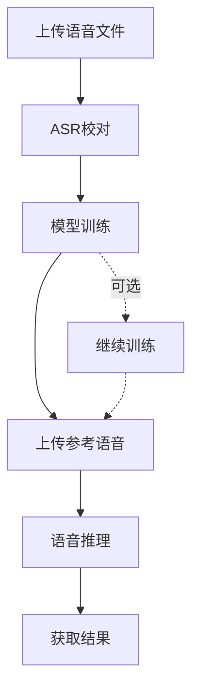

# MockVox API 简明指南

## 概述

本API提供语音处理、模型训练与推理的全流程服务，核心功能包含：

- 🎵 语音文件预处理（切片/降噪） 
- 🎓 GPT-SoVITS模型训练
- 🎙️ 多语言语音推理合成
- 📊 异步任务状态追踪

## 快速开始

```bash
# 上传语音文件
 curl -X POST -F "file=@sample.wav" \
    -F "language=zh" \
    http://127.0.0.1:5000/upload
# 返回 file_id

# 启动训练任务
curl -X POST \
    -F "file_id={file_id}" \
    -F "epochs_sovits=2" \
    -F "epochs_gpt=2" \
    http://127.0.0.1:5000/train
# 返回 model_id

# 上传参考语音
curl -X POST -F "file=@ref.wav" http://127.0.0.1:5000/uploadRef
# 返回 ref_file_id

# 推理
curl -X POST -F "model_id={model_id}" \
-F "ref_audio_file_id={ref_file_id}" \
-F "ref_text=生日快乐" \
-F "target_text=让我们庆祝吧" \
http://127.0.0.1:5000/inference

# 获取推理结果
curl -X GET http://127.0.0.1:5000/output/{task_id}
```

## 使用流程



### 1. 语音文件预处理

**接口路径**：`POST /upload`

参数：

| 参数 | 类型 | 说明 |
|------|------|-----|
| file | File | 支持 WAV/MP3/FLAC 格式 |
| language | String | 语言(默认zh, 支持zh/can/en/ja/ko) |

响应示例：

```json
{
    "file_id": "20250522095117519601.e6abd9db.896806622ccb47a9ac1ee1669daf1938",
    "task_id": "40425f97-11ab-4d68-b645-bd8dda294c4c",
    "asr": [
        {"key": "0000000000_0000193600", "text": "Hello world"},
        {"key": "0000193600_0000361920", "text": "Good morning"}
    ]
}
```

### 2. ASR结果校对

**接口路径**：`POST /revision`

参数：

| 参数 | 类型 | 说明 |
|------|------|-----|
| file_id | String | /upload 返回的文件ID |
| results | List | ASR校对结果 |

请求格式：

```json
{
    "file_id": "20250522095117519601.e6abd9db.896806622ccb47a9ac1ee1669daf1938",
    "results": [
        {"key": "0000000000_0000193600", "text": "Hello world"},
        {"key": "0000193600_0000361920", "text": "Good morning"}
    ]
}
```

### 3. 模型训练

**接口路径**：`POST /train`

训练参数：

| 参数 | 类型 | 说明 |
|------|------|-----|
| file_id | String | /upload 返回的文件ID |
| epochs_sovits | Integer | SoVITS训练轮次 |
| epochs_gpt | Integer | GPT训练轮次 |
| version | String | 模型版本(支持v2/v4), 默认v4 |
| denoised | Bool | 是否已降噪, 默认True |

响应示例：

```json
{
    "message": "训练任务已进入Celery处理队列",
    "file_id": "20250522095117519601.e6abd9db.896806622ccb47a9ac1ee1669daf1938",
    "task_id": "40425f97-11ab-4d68-b645-bd8dda294c4c"
}
```

### 4. 继续训练

**接口路径**：`POST /resume`

训练参数：

| 参数 | 类型 | 说明 |
|------|------|-----|
| model_id | String | /train 返回的模型ID |
| epochs_sovits | Integer | SoVITS训练轮次 |
| epochs_gpt | Integer | GPT训练轮次 |

### 5. 上传参考语音

**接口路径**：`POST /uploadRef`  

参数：

| 参数 | 类型 | 说明 |
|------|------|-----|
| file | File | 支持 WAV/MP3/FLAC 格式 |

响应示例：

```json
{
    "file_id": "20250515174637881830.074d49dd.f0b12bcb828a4ab3b6fb8bd64aaeacf8"
}
```

### 6. 语音推理

**接口路径**：`POST /inference`

参数：

| 参数 | 类型 | 默认值 | 说明 |
|------|------|-----|-----|
| model_id | String | - | /train 返回的模型ID |
| ref_audio_file_id | String | - | /uploadRef 返回的参考语音文件ID |
| ref_text | String | - | 参考语音的文本 |
| ref_language | String | zh | 参考语音的语言(zh/can/en/ja/ko) |
| target_text | String | - | 待合成的目标文本 |
| target_language | String | zh | 目标文本的语言编码 |
| top_p | Float | 1 | top_p |
| temperature | Float | 1 | temperature |
| speed | Float | 1 | 语速 |

目标文本语言编码参见 [《命令行用户指南》](./cli.md)

响应示例：

```json
{
    "message": "推理任务已进入Celery处理队列",
    "task_id": "40425f97-11ab-4d68-b645-bd8dda294c4c"
}
```

### 7. 获取推理结果

**接口路径**：`GET /output/{task_id}`

## 任务监控

```bash
curl -X GET http://127.0.0.1:5000/tasks/{task_id}

响应示例
{
    "status": "SUCCESS",
    "results": "",
    "time": "2025-03-15T14:30:00"
}
```

## 注意事项

1. **文件规范**：
   - 最大上传尺寸：`5000MB`
   - 支持格式：`.wav` > `.flac` > `.mp3`

2. **错误处理**：

```json
{
    "detail": "文件大小超过限制（错误码413）"
}
```

3. **性能建议**：
   - 训练任务建议配置 ≥16GB显存
   - 推理任务延迟约 3-8秒（取决于文本长度）

[🔧 查看实时API文档](http://127.0.0.1:5000/docs)  
[🐳 获取Docker部署指南](https://github.com/mockvox/README.md)
