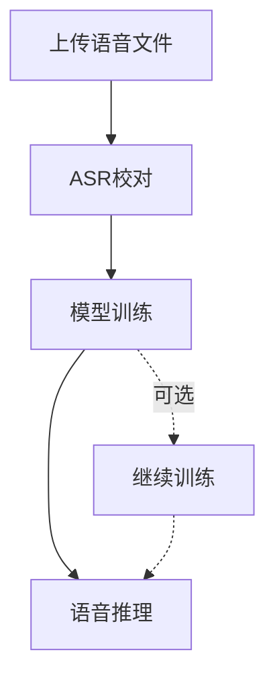

# MockVox 命令行工具使用指南

## 概述

MockVox 是一款语音合成&语音克隆工具包，支持音频上传、模型训练和语音合成三大核心功能。本文档详细说明命令语法、参数配置及使用示例。

---

## 环境要求

- 已安装 MeCab 库 (用于语言特征处理)
- Python 3.11+ 运行环境
- 有效的 API 凭证 (若使用云端服务)

---

## 使用流程



---

## 命令手册

### 1. 🚀 上传语音样本

```bash
mockvox upload [选项] 文件路径
```

**功能**：预处理原始音频文件

| 参数                | 说明                                  | 默认值 | 必填 |
|---------------------|---------------------------------------|--------|------|
| `文件路径`          | 音频文件绝对路径                      | -      | 是   |
| `--no-denoise`      | 禁用自动降噪处理                      | 降噪   | 否   |
| `--language 语言码` | 语言编码 (支持 zh/can/en/ja/ko)        | zh | 否  |

**示例**：

```bash
mockvox upload /data/样本.wav --language zh 
```

返回值中包含一个文件ID{fileID}。

自动语音识别的结果，保存在 ./data/asr/{fileID}/output.json 文件中，编辑该文件即可进行ASR校对。

语音切片的结果保存在 ./data/sliced/{fileID} 目录；降噪之后的结果保存在 ./data/denoised/{fileID} 目录.

---

### 2. 🧠 训练语音模型

```bash
mockvox train [选项] 文件ID #文件ID来自upload的返回值
```

**功能**：基于上传样本训练定制语音模型

| 参数                   | 说明                                  | 默认值 | 必填 |
|------------------------|---------------------------------------|--------|------|
| `文件ID`               | 上传命令返回的标识符                  | -      | 是   |
| `--epochs_sovits 轮次`| SoVITS 模型训练轮次                   | 1     | 否   |
| `--epochs_gpt 轮次`   | GPT 模型训练轮次                      | 1     | 否   |
| `--version 版本号`     | 模型架构版本 (v2/v4)                          | v4     | 否   |
| `--no-denoise`         | 使用未降噪的音频                  | 降噪   | 否   |

**示例**：

```bash
mockvox train "20250522095117519601.e6abd9db.896806622ccb47a9ac1ee1669daf1938" --epochs_sovits 2 --epochs_gpt 2
```

---

### 3. 🔊 生成语音合成

```bash
mockvox inference [选项] 模型ID 参考音频 提示文本 目标文本
```

**功能**：使用训练模型合成目标语音

| 参数                | 说明                                  | 默认值 | 必填 |
|---------------------|---------------------------------------|--------|------|
| `模型ID`            | train返回的模型ID                  | -      | 是   |
| `参考音频`          | 语音风格参考文件的绝对路径            | -      | 是   |
| `提示文本`          | 参考音频的文本                        | -      | 是   |
| `目标文本`          | 待合成的目标文本                      | -      | 是   |
| `--promptLanguage`      | 参考音频的语言编码(支持 zh/can/en/ja/ko)     | zh   | 否   |
| `--targetLanguage`      | 目标文本的语言编码                        | zh   | 否   |
| `--top_p` | Top-p | 1 | 否 |
| `--top_k` | Top-k | 15 | 否 |
| `--temperature` | temperature | 1 | 否 |
| `--speed` | 语速 | 1 | 否 |

**目标文本语言编码**:

| 语言编码      | 说明              |
|---------------------|---------------------------------------|
| all_zh    | 全中文    |
| all_can   | 全粤语    |
| en    | 全英文    |
| all_ja    | 全日文    |
| all_ko    | 全韩语    |
| zh    | 中英混合  |
| ja    | 日英混合  |
| can   | 粤英混合  |
| ko    | 韩英混合  |
| auto  | 多语种自动识别(不含粤语)    |
| auto_can  | +粤语的多语种自动识别 |

**示例**：

```bash
mockvox inference "20250522095117519601.e6abd9db.896806622ccb47a9ac1ee1669daf1938" /ref/参考音频.wav "生日快乐" "让我们庆祝吧！"
```

推理结果保存在 ./data/output 目录。

---

### 4. ⏯ 恢复模型训练

```bash
mockvox resume [选项] 模型ID
```

**功能**​​：从已有检查点继续训练模型

| 参数                | 说明                                  | 默认值 | 必填 |
|---------------------|---------------------------------------|--------|------|
| `模型ID`            | train返回的模型ID                  | -      | 是   |
| `--epochs_sovits 轮次`| SoVITS 模型训练轮次                   | 2     | 否   |
| `--epochs_gpt 轮次`   | GPT 模型训练轮次                      | 2     | 否   |

**示例**：

```bash
mockvox resume 20250524182510033061.370358d9.af07654e5ffe46c788448c05a0dedca3 --epochs_sovits 3 --epochs_gpt 5
```

**实现细节​**​：

1. 自动加载 ./data/weights/{模型ID} 目录下的最新检查点
2. 新增训练结果会覆盖原有模型文件

### 5. ℹ️ 查看模型信息

```bash
mockvox info 模型ID
```

**​​功能**​​：显示模型训练元数据

| 参数                | 说明                                  | 默认值 | 必填 |
|---------------------|---------------------------------------|--------|------|
| `模型ID`            | train返回的模型ID                  | -      | 是   |

## 核心特性

- **版本控制**：通过 `--version` 控制模型版本
- **智能降噪**：默认启用降噪处理 (可用 `--no-denoise` 禁用)
- **多语言支持**：支持中/粤/英/日/韩5种语言
- **流程管控**：严格的工作流顺序 (上传 → 校对[可选] → 训练 → 继续训练 → 合成)

---


## 故障排查

❗ 若出现 `MeCab not found` 错误：

```bash
Debian/Ubuntu 系统
sudo apt-get install mecab libmecab-dev mecab-ipadic
```

❗ 使用绝对路径避免文件路径解析错误

❗ 小数据集训练周期超过 30 可能导致过拟合

---
