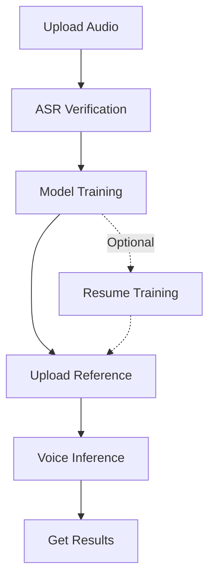

# MockVox API Quickstart Guide

## Overview

This API provides end-to-end voice processing services including model training and inference. Core capabilities:

- 🎵 Audio preprocessing (slicing/noise reduction)
- 🎓 GPT-SoVITS model training
- 🎙️ Multilingual voice synthesis
- 📊 Asynchronous task monitoring

## Quick Start

```bash
# Upload audio file
curl -X POST -F "file=@sample.wav" \
    -F "language=zh" \
    http://127.0.0.1:5000/upload
# Returns file_id

# Start training
curl -X POST \
    -F "file_id={file_id}" \
    -F "epochs_sovits=2" \
    -F "epochs_gpt=2" \
    http://127.0.0.1:5000/train
# Returns model_id

# Upload reference audio
curl -X POST -F "file=@ref.wav" http://127.0.0.1:5000/uploadRef
# Returns ref_file_id

# Inference
curl -X POST -F "model_id={model_id}" \
-F "ref_audio_file_id={ref_file_id}" \
-F "ref_text=生日快乐" \
-F "target_text=让我们庆祝吧" \
http://127.0.0.1:5000/inference

# Get results
curl -X GET http://127.0.0.1:5000/output/{task_id}
```

## WorkFlow



### 1. Audio Preprocessing

**Endpoint**​​: `POST /upload`

Parameters:

| Parameter | Type | Description | Default | Required |
|------|------|-----|-----|-----|
| file | File | WAV/MP3/FLAC formats | - | Yes |
| language | String | Language code (supported: zh/can/en/ja/ko) | zh | No |

Response example:

```json
{
    "file_id": "20250522095117519601.e6abd9db.896806622ccb47a9ac1ee1669daf1938",
    "task_id": "40425f97-11ab-4d68-b645-bd8dda294c4c",
    "asr": [
        {"key": "0000000000_0000193600", "text": "Hello world"},
        {"key": "0000193600_0000361920", "text": "Good morning"}
    ]
}
```

### 2. ASR Result Verification

**Endpoint**：`POST /revision`

Parameters:

| Parameter | Type | Description | Required |
|------|------|-----|-----|
| file_id | String | File ID from /upload | Yes |
| results | List | Corrected ASR outputs | Yes |

Request format:

```json
{
    "file_id": "20250522095117519601.e6abd9db.896806622ccb47a9ac1ee1669daf1938",
    "results": [
        {"key": "0000000000_0000193600", "text": "Hello world"},
        {"key": "0000193600_0000361920", "text": "Good morning"}
    ]
}
```

### 3. Model Training

**Endpoint**：`POST /train`

Parameters：

| Parameter | Type | Description | Default| Required |
|------|------|-----|-----|-----|
| file_id | String | File ID from /upload | - | Yes |
| epochs_sovits | Integer | SoVITS training epochs | 1 | No |
| epochs_gpt | Integer | GPT training epochs | 1 | No |
| version | String | Model version (v2/v4) | v4 | No
| denoised | Bool | Use denoised audio | True | No |

Response example:

```json
{
    "message": "Training task queued in Celery",
    "file_id": "20250522095117519601.e6abd9db.896806622ccb47a9ac1ee1669daf1938",
    "task_id": "40425f97-11ab-4d68-b645-bd8dda294c4c"
}
```

### 4. Resume Training

**Endpoint**: `POST /resume`

Parameters:

| Parameter      | Type    | Description | Default | Required |
|----------------|---------|-------------|-------|----------|
| model_id       | String  | Model ID from /train | - | Yes |
| epochs_sovits  | Integer | SoVITS training epochs | 2 | No |
| epochs_gpt     | Integer | GPT training epochs | 2 | No |

### 5. Upload Reference Audio

**Endpoint**: `POST /uploadRef`

Parameters:

| Parameter | Type   | Description |
|-----------|--------|-------------|
| file      | File   | WAV/MP3/FLAC formats |

Response example:

```json
{
    "file_id": "20250515174637881830.074d49dd.f0b12bcb828a4ab3b6fb8bd64aaeacf8"
}
```

### 6. Voice Inference

**Endpoint**：`POST /inference`

Parameters:

| Parameter | Type | Description | Default | Required |
|------|------|-----|-----|-----|
| model_id | String | Model ID from /train | - | Yes |
| ref_audio_file_id | String | Reference audio ID from /uploadRef | - | Yes |
| ref_text | String | Text of reference audio | - | Yes |
| ref_language | String | Language code (zh/can/en/ja/ko) | zh | No |
| target_text | String | Target synthesis text | - | Yes |
| target_language | String | Target language code | zh | No |
| top_p | Float | Top-p sampling | 1 | No |
| top_k | Integer | Top-k sampling | 15 | No |
| temperature | Float | Sampling temperature | 1 | No |
| speed | Float | Speech speed | 1 | No |

Target language codes: See [CLI Guide](./cli.md)

Response example:

```json
{
    "message": "Inference task queued in Celery",
    "task_id": "40425f97-11ab-4d68-b645-bd8dda294c4c"
}
```

### 7. Get Inference Results

**Endpoint**：`GET /output/{task_id}`

## Task Monitoring

```bash
curl -X GET http://127.0.0.1:5000/tasks/{task_id}

Response example
{
    "status": "SUCCESS",
    "results": "",
    "time": "2025-03-15T14:30:00"
}
```

## Important Notes

1. **File Requirements**:
   - Max size: `5000MB`
   - Supported formats: `.wav` > `.flac` > `.mp3`

2. **Error Handling**:

```json
{
    "detail": "File size exceeds limit (Error 413)"
}
```

3. **Performance Recommendations​​**:
   - Training requires ≥16GB GPU memory
   - Inference latency: 3-8 seconds (text-dependent)

[🔧 Live API Documentation](http://127.0.0.1:5000/docs)  
[🐳 Docker Deployment Guide](https://github.com/mockvox/README.md)